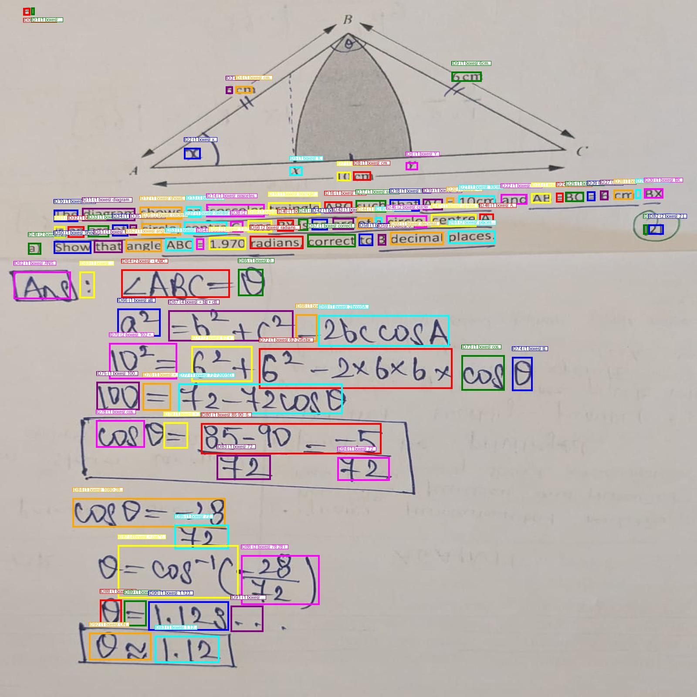
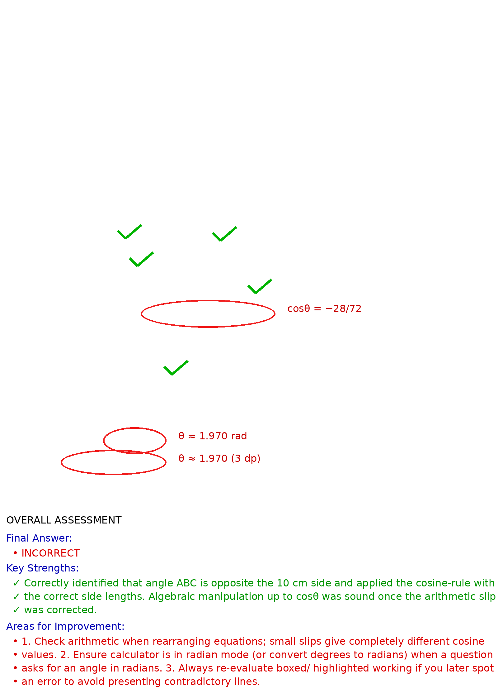
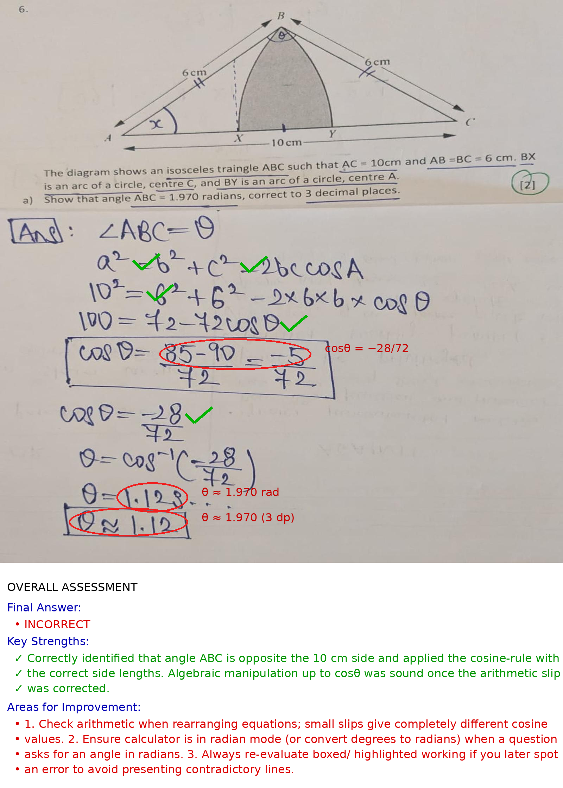

# OCR + GPT Vision Pipeline

Extracts text and bounding boxes with Google Vision, builds a grading/evaluation prompt, sends the prompt + image to OpenAI (vision model), and renders a correction overlay.

## Features
- Google Vision OCR → grouped word boxes + labeled preview
- Prompt generator encodes regions, text, and coordinates
- OpenAI (vision-capable) returns strict JSON of corrections
- Overlay renderer draws circles/checks and adds an assessment panel
- One‑command pipeline saves all artifacts under `outputs/`

## Requirements
- Python 3.9+
- API keys: Google Vision + OpenAI
- Install packages: `pip install -r requirements.txt`

## Setup
1. Copy `.env.example` → `.env`
2. Set your keys:
   - `GOOGLE_VISION_API_KEY=...`
   - `OPENAI_API_KEY=...`
   - Optional: `OPENAI_BASE_URL=...` (custom gateway)
   - Optional: `OPENAI_MODEL=gpt-4o` (default is a vision-capable model)

## Quickstart
```
python run_pipeline.py --image OCR_exam/comprehension1.jpg
```

Offline/Secrets-safe options:
- Use existing OCR json (skip Google Vision):
```
python run_pipeline.py --image OCR_exam/comprehension1.jpg \
  --use-ocr-json ocr_data.json --skip-ocr
```
- Use existing corrections json (skip OpenAI):
```
python run_pipeline.py --image OCR_exam/comprehension1.jpg \
  --use-corrections corrections.json --skip-openai
```
- Both (pure offline overlay render):
```
python run_pipeline.py --image OCR_exam/comprehension1.jpg \
  --use-ocr-json ocr_data.json --skip-ocr \
  --use-corrections corrections.json --skip-openai
```
## Example Images

These examples are included in the repo and demonstrate the outputs:

- `visualized_boxes.jpg` — OCR regions preview  
- `corrected_overlay.png` — on-image corrections  
- `corrected_overlay_complete.png` — overlay with assessment panel

<table>
  <tr>
    <td align="center">
      <a href="visualized_boxes.jpg">
        
      </a><br>
      <sub><b>OCR Regions Preview</b><br><code>visualized_boxes.jpg</code></sub>
    </td>
    <td align="center">
      <a href="corrected_overlay.png">
        
      </a><br>
      <sub><b>On-Image Corrections</b><br><code>corrected_overlay.png</code></sub>
    </td>
    <td align="center">
      <a href="corrected_overlay_complete.png">
        
      </a><br>
      <sub><b>Overlay + Panel</b><br><code>corrected_overlay_complete.png</code></sub>
    </td>
  </tr>
</table>


## Notes
- Model: Use a vision-capable model (e.g., `gpt-4o`, `o4`) so the image is considered along with the prompt.
- Security: `.env` is git-ignored; do not commit keys. If any key previously appeared in code, rotate it.
- Reproducibility: All generated artifacts are placed in `outputs/` to keep the repo clean.

## Troubleshooting
- Vision auth errors: ensure billing is enabled and `GOOGLE_VISION_API_KEY` is valid.
- OpenAI model errors: ensure the model supports images. Change `OPENAI_MODEL` to `gpt-4o` or `o4`.
- Fonts: On Windows, the overlay uses `arial.ttf` if available, otherwise falls back to a default font.

